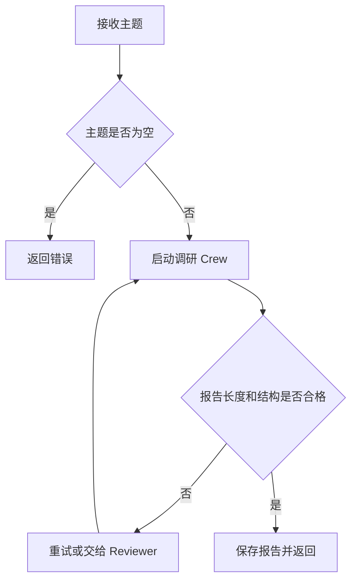

# 练习答案

这里给出参考答案，不是唯一答案。更重要的是看你的拆分是否有边界、有交付物、有上下文传递。

## 核心概念练习

题目：把“帮我分析一个开源项目是否适合学习”拆成 3 个 Agent 和 4 个 Task。

参考 Agent：

| Agent | 责任 |
| --- | --- |
| 项目研究员 | 读取 README、文档和仓库结构。 |
| 工程分析师 | 判断技术栈、复杂度、维护状态。 |
| 学习教练 | 输出学习路径和练习安排。 |

参考 Task：

| Task | expectedOutput |
| --- | --- |
| repo_summary | 项目用途、主要模块、运行方式。 |
| complexity_analysis | 技术栈、学习门槛、风险点。 |
| learning_plan | 7 天学习计划，每天目标和产出。 |
| final_recommendation | 是否适合学习，给出理由和替代建议。 |

## Flow 练习

题目：为“生成课程调研报告”画一个 Flow。

参考：

## Tool 练习

题目：设计 3 个 Tool。

参考：

| Tool | 输入 | 输出 |
| --- | --- | --- |
| `read_readme` | 仓库路径或 URL | README 摘要、运行命令、主要功能。 |
| `analyze_package` | `package.json` 内容 | scripts、dependencies、框架判断。 |
| `build_learning_plan` | 项目摘要和学习目标 | 分阶段学习计划。 |

