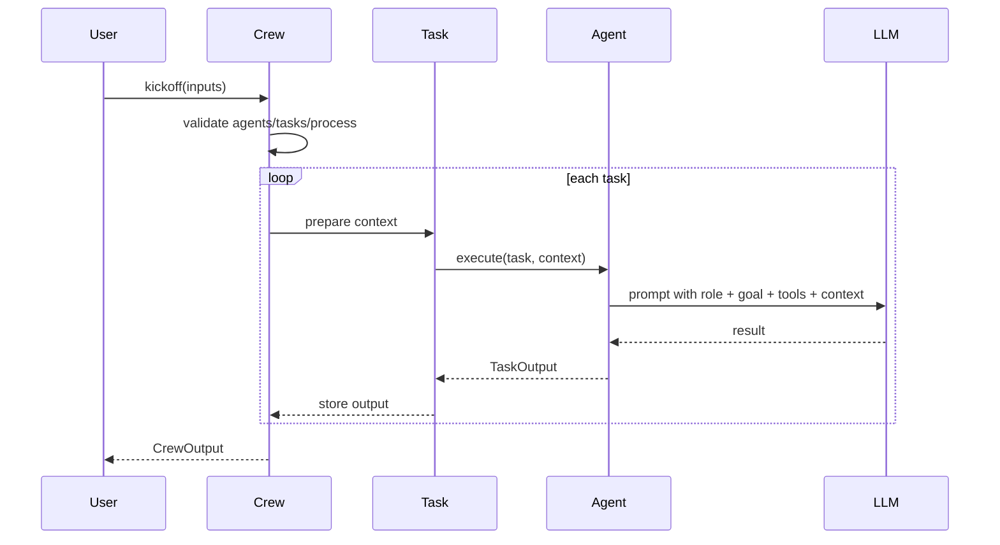
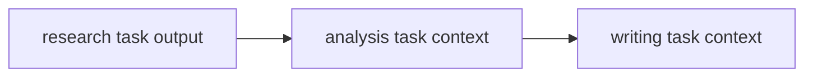

# Agent / Task / Crew

这一章只讲 crewAI 最核心的三件套：Agent、Task、Crew。它们的关系可以用一句话概括：

> Agent 是谁来做，Task 是做什么，Crew 是如何把一群人和一批事组织起来。

## Agent：角色不是名字，而是约束

一个 Agent 通常包含：

| 字段 | 作用 |
| --- | --- |
| `role` | 这个 Agent 在团队中的身份。 |
| `goal` | 它应该优化的目标。 |
| `backstory` | 给模型的行为背景，让输出风格更稳定。 |
| `tools` | 它能调用的外部工具。 |
| `llm` | 它使用的模型。 |

教学版 TypeScript 中可以这样建模：

```ts
export type Agent = {
  role: string;
  goal: string;
  backstory: string;
  tools: Tool[];
  run(task: Task, context: TaskOutput[]): Promise<TaskOutput>;
};
```

注意：`role` 不只是展示用文本，它会进入 prompt，影响模型如何理解自己。一个好的角色应该带边界。

| 模糊角色 | 更好的角色 |
| --- | --- |
| AI 专家 | 负责搜集可信资料的研究员 |
| 内容助手 | 把分析结论写成结构化报告的技术写作者 |
| 数据专家 | 负责从输入中提取约束和风险的分析师 |

## Task：把目标拆成可验收的工作单元

Task 的关键不是“描述一下要做什么”，而是让 Agent 知道完成标准。

```ts
export type Task = {
  id: string;
  description: string;
  expectedOutput: string;
  agent: Agent;
  context?: Task[];
};
```

`expectedOutput` 很重要。没有期望输出，Agent 容易把任务理解成闲聊。

示例：

```ts
const researchTask = {
  id: "research",
  description: "围绕用户主题收集 5 条关键事实，并标注可信度。",
  expectedOutput: "Markdown 列表，每条包含事实、来源类型、可信度。",
  agent: researcher
};
```

## Crew：把人和事组织成执行系统

Crew 至少要知道：

- 有哪些 Agent。
- 有哪些 Task。
- 使用什么 Process。
- 如何启动执行。



## Task context：任务之间如何传递信息

multi Agent 不是“大家同时说话”，而是“前一个人的产出成为后一个人的输入”。



在教学版里，我们会把前置任务输出放进 `context`：

```ts
const analysisTask = {
  id: "analysis",
  description: "根据研究结果提炼机会、风险和建议。",
  expectedOutput: "包含机会、风险、建议的结构化分析。",
  agent: analyst,
  context: [researchTask]
};
```

## 易踩坑

| 错误 | 后果 | 修正 |
| --- | --- | --- |
| Agent 角色过宽 | 输出像万能助手，缺少专业边界。 | 给角色加具体责任和交付物。 |
| Task 没有验收标准 | Agent 容易写散文。 | 写清 `expectedOutput`。 |
| 所有 Task 都给同一个 Agent | multi Agent 退化成单 Agent。 | 按知识、工具和责任拆角色。 |
| 上下文随便传 | 后续任务拿不到关键依据。 | 显式声明 Task 依赖。 |

## 小练习

把“帮我分析一个开源项目是否适合学习”拆成 3 个 Agent 和 4 个 Task。要求每个 Task 都写出 `expectedOutput`。
