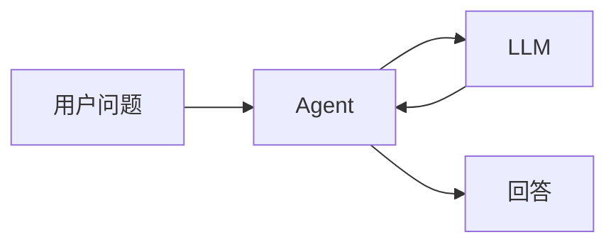
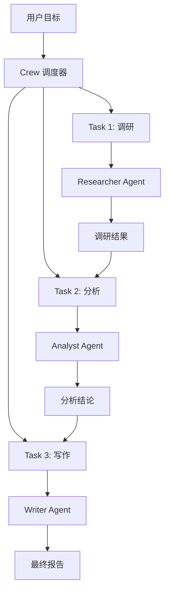
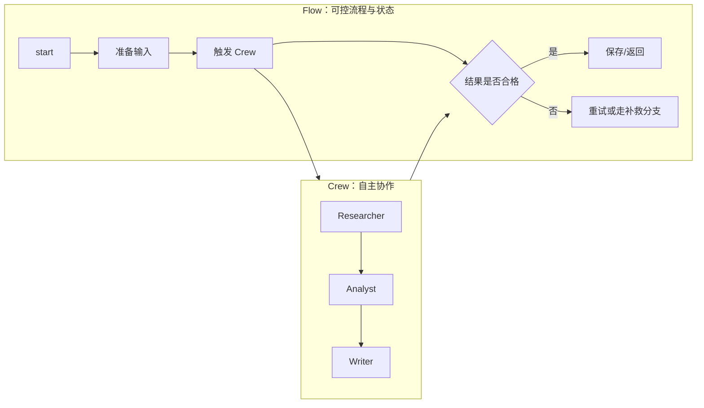

# 整体架构

crewAI 的核心目标很直白：把“一个大模型调用”组织成“一组有角色、有工具、有流程的智能体协作”。它不是单纯帮你拼 prompt，而是给 multi Agent 应用提供一套工程结构。

## 从单 Agent 到 multi Agent

一个单 Agent 通常长这样：

这适合简单问答，但复杂任务会遇到三个问题：

| 问题 | 表现 |
| --- | --- |
| 职责混乱 | 同一个 prompt 里既要研究、又要判断、又要写作。 |
| 上下文膨胀 | 所有信息都塞给一个模型，成本高，还容易丢重点。 |
| 不可观测 | 出错时你不知道是资料错、分析错，还是表达错。 |

multi Agent 的思路是把复杂任务拆成角色协作：

这里真正重要的不是“有三个名字很酷的机器人”，而是职责边界清楚了：调研 Agent 对资料负责，分析 Agent 对判断负责，写作 Agent 对表达负责。

## crewAI 的两条主线：Crews 与 Flows

官方文档把 crewAI 的架构分成两个互补部分：

| 结构 | 适合解决 | 类比 |
| --- | --- | --- |
| Crew | 让一组 Agent 自主协作完成复杂任务 | 一个小团队 |
| Flow | 用事件、状态和分支精确控制应用流程 | 工作流引擎 |

简单说：Crew 负责“让智能体干活”，Flow 负责“让系统可靠地往前走”。

## 关键模块一览

| 模块 | 责任 | 教学版会实现吗 |
| --- | --- | --- |
| Agent | 定义角色、目标、背景、工具和模型调用方式。 | 会 |
| Task | 定义要完成的事情、期望输出和上下文依赖。 | 会 |
| Crew | 管理 Agent 和 Task，按照 Process 执行。 | 会 |
| Process | 决定任务顺序，例如 sequential 或 hierarchical。 | 会实现 sequential |
| Flow | 用状态和事件组织更大的应用链路。 | 会实现轻量版 |
| Tool | 让 Agent 调用外部能力，例如搜索、数据库、API。 | 会 |
| Memory | 保存长期或短期经验。 | 会讲原理，Demo 做轻量上下文 |
| Knowledge | 把领域资料作为可检索知识注入任务。 | 会讲原理 |

## 一个工程师视角的设计原则

设计 multi Agent 系统时，优先问这三个问题：

1. 这个任务有没有天然的角色分工？
2. 每个角色需要哪些外部能力？
3. 哪些步骤必须被流程严格控制？

如果一个问题只需要一次模型调用，就不要硬拆 Agent。multi Agent 的价值来自清晰分工和可观测流程，不来自数量。

::: tip 工程经验
最容易失败的 multi Agent 不是 Agent 太少，而是每个 Agent 的职责太抽象。`专家` 不是好角色，`负责查找 5 条可信资料的研究员` 才是。
:::

