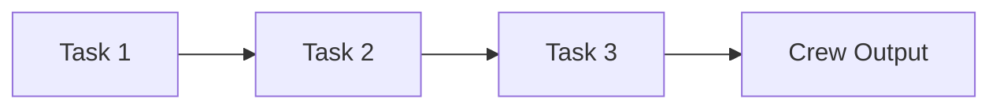
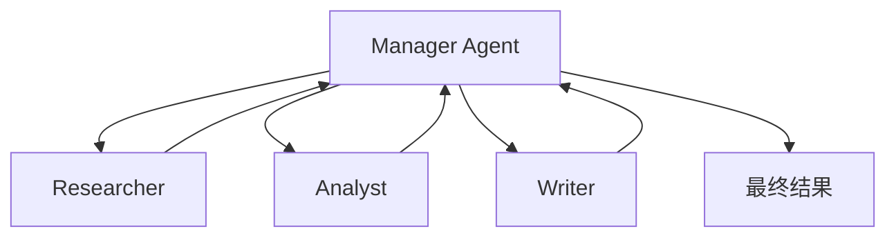
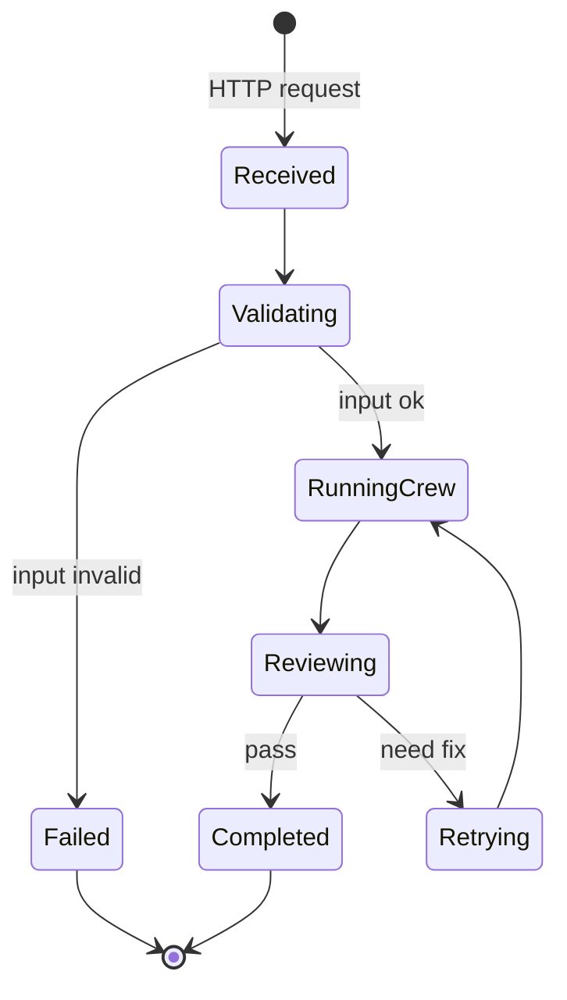

# Process 与 Flow

Process 和 Flow 都和“流程”有关，但层级不同。

| 名称 | 作用范围 | 解决的问题 |
| --- | --- | --- |
| Process | Crew 内部任务怎么执行 | Agent 团队内部的协作方式 |
| Flow | 应用整体怎么推进 | 状态、事件、分支、重试、外部系统 |

## Process：Crew 内部的执行策略

crewAI 常见 Process 包括：

| Process | 特点 | 适合场景 |
| --- | --- | --- |
| sequential | 按任务列表顺序执行，每个任务可消费前面任务输出。 | 教程、报告生成、流水线任务。 |
| hierarchical | 由 manager agent 进行分配、委派和校验。 | 任务更复杂，需要动态调度。 |

教学版先实现 sequential，因为它最适合建立执行链路的直觉。

顺序执行看起来简单，但它解决了两个关键问题：

- 让复杂目标变成可观察的中间结果。
- 让每一步的输出有机会被下一步利用。

## hierarchical：为什么需要 manager

当任务不能提前完全拆好时，顺序执行会吃力。例如“分析一个陌生行业并制定进入策略”，中途可能发现需要补充调研、换一个分析角度、或让某个 Agent 重做。

hierarchical 的思路是引入 manager：

官方 `Crew` 源码里也能看到与 hierarchical 相关的约束：如果使用 hierarchical process，需要 `manager_llm` 或 `manager_agent` 来协调。

## Flow：把智能体协作放进产品流程

Crew 像一个会干活的小团队；Flow 像业务系统的流程控制器。

真实应用通常需要：

- 接收 HTTP 请求。
- 校验输入。
- 创建任务状态。
- 触发 Crew。
- 判断结果是否合格。
- 保存日志或返回给前端。

这不是 Agent 自己应该负责的。它属于 Flow。

## 什么时候用 Crew，什么时候用 Flow

| 需求 | 优先选择 |
| --- | --- |
| 让多个角色合作完成一份报告 | Crew |
| 对任务步骤做严格状态管理 | Flow |
| 某一步需要自主调研、分析、生成 | Flow 中调用 Crew |
| 需要 API、数据库、重试、人工审核 | Flow |

::: tip 实战建议
生产项目通常先设计 Flow，再把其中需要智能协作的步骤交给 Crew。这样系统边界清楚：业务可靠性归 Flow，智能生成归 Crew。
:::

## 小练习

为“生成一份课程调研报告”画一个 Flow。至少包含：输入校验、Crew 执行、结果检查、失败返回、成功保存。

