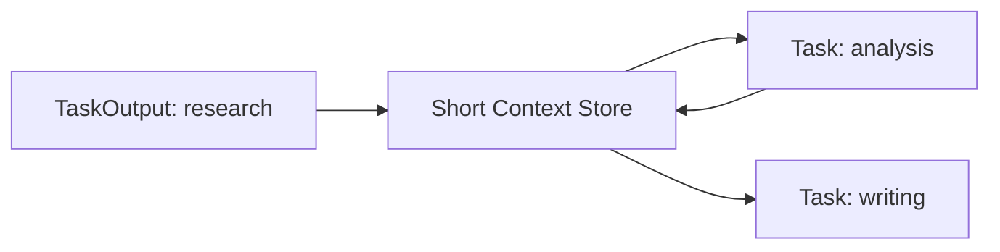

# Tools / Memory / Knowledge

Agent 只靠 LLM 会有两个明显短板：不知道外部实时信息，也不会自然保存长期经验。Tools、Memory、Knowledge 就是为了解决这些问题。

## Tool：把外部能力接进 Agent

Tool 是一个有名字、有描述、有输入、有输出的函数。Agent 可以根据任务选择调用它。

```ts
export type Tool = {
  name: string;
  description: string;
  run(input: string): Promise<string>;
};
```

示例：

```ts
const webSearchTool: Tool = {
  name: "web_search",
  description: "搜索公开网页，返回与主题相关的摘要。",
  async run(input) {
    return `搜索结果摘要：${input} 的相关资料...`;
  }
};
```

关键点：Tool 的描述会影响模型是否调用它。描述越具体，模型越容易做对选择。

## Tool 的工程边界

不要让 Tool 变成“万能入口”。一个好 Tool 应该：

- 输入结构清楚。
- 输出格式稳定。
- 错误可被捕获。
- 不把密钥暴露给模型。
- 不执行危险命令。

| 坏设计 | 好设计 |
| --- | --- |
| `run_any_shell_command` | `read_project_file_summary` |
| `call_api` | `search_docs(query: string)` |
| 输出一大段 HTML | 输出结构化 JSON 或简洁 Markdown |

## Memory：让系统记住上下文

Memory 通常分为：

| 类型 | 作用 |
| --- | --- |
| 短期记忆 | 当前任务或当前会话中的上下文。 |
| 长期记忆 | 跨会话保存经验、偏好或历史结果。 |
| 实体记忆 | 记录人、项目、组织等实体信息。 |

crewAI 官方源码中，`Crew` 支持 `memory` 字段，并在启用后创建统一记忆对象。教学版为了保持简单，只实现“任务上下文传递”，相当于最小短期记忆。



## Knowledge：把领域资料变成可检索材料

Knowledge 更像“资料库”，Memory 更像“经验和上下文”。例如：

| 内容 | 更像 Memory 还是 Knowledge |
| --- | --- |
| 用户上次喜欢短报告 | Memory |
| 公司产品手册 PDF | Knowledge |
| 本轮研究得到的 5 条事实 | 短期 Memory / Context |
| 某技术规范文档 | Knowledge |

实际项目里，Knowledge 往往会进入 RAG 流程：切分文档、向量化、检索、注入 prompt。

## 易踩坑

| 错误 | 为什么危险 |
| --- | --- |
| Tool 没有权限边界 | Agent 可能调用它做超出预期的事。 |
| Memory 什么都存 | 成本上升，噪声增加，还可能泄露敏感信息。 |
| Knowledge 不标来源 | 后续无法判断回答可信度。 |
| Tool 输出不可预测 | 下一个 Agent 很难稳定消费。 |

## 小练习

为“开源项目学习助手”设计 3 个 Tool：一个读取 README，一个分析 package 文件，一个生成学习计划。写出它们的输入和输出格式。
