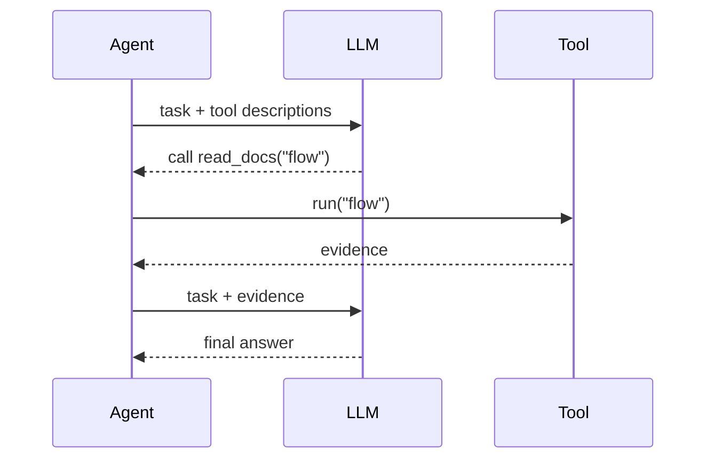

# Demo 03：Tools

第三个 Demo 加入 Tool。Tool 的意义是把 Agent 从“只会生成文本”变成“能使用外部能力”。

## 目标

实现一个 `readDocs` 工具，让 Researcher Agent 可以读取一段内置资料，再基于资料回答。

## 代码

```ts
type Tool = {
  name: string;
  description: string;
  run(input: string): Promise<string>;
};

const docs: Record<string, string> = {
  crew: "Crew 是一组 Agent 和 Task 的组织方式。",
  flow: "Flow 用状态、事件和分支控制应用执行。"
};

const readDocs: Tool = {
  name: "read_docs",
  description: "读取内置教程资料。输入关键词 crew 或 flow。",
  async run(input) {
    return docs[input] ?? "没有找到资料。";
  }
};

class Agent {
  constructor(
    private role: string,
    private tools: Tool[]
  ) {}

  async execute(question: string) {
    const keyword = question.toLowerCase().includes("flow") ? "flow" : "crew";
    const tool = this.tools.find((item) => item.name === "read_docs");
    const evidence = tool ? await tool.run(keyword) : "无工具结果";

    return [
      `角色：${this.role}`,
      `问题：${question}`,
      `工具证据：${evidence}`,
      `回答：基于上面的资料进行解释。`
    ].join("\n");
  }
}

const researcher = new Agent("资料研究员", [readDocs]);
console.log(await researcher.execute("Crew 和 Flow 有什么区别？"));
```

## 真实 LLM 中 Tool 如何被选择

真实 Agent 通常会把工具列表放进 prompt：

```txt
你可以使用这些工具：
- read_docs：读取内置教程资料。输入关键词 crew 或 flow。
```

模型根据任务判断是否调用工具。框架再负责把工具执行结果放回上下文。



## 小练习

给 `readDocs` 增加一个结构化返回：

```ts
{ title: string; content: string; source: string }
```

想一想：为什么结构化输出比普通字符串更适合给下一个 Agent 使用？

