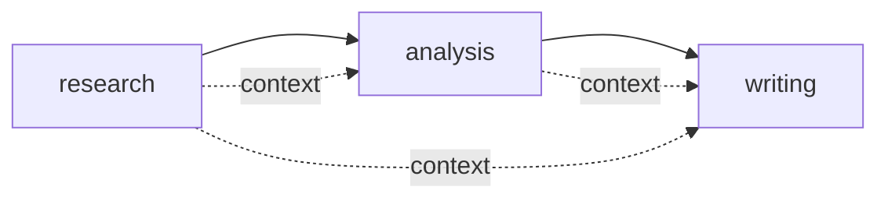

# Demo 04：顺序 Crew

第四个 Demo 把 Agent、Task、Tool 放进 Crew。现在我们开始接近 crewAI 的核心链路。

## 目标

实现一个顺序执行的 Crew：

```txt
research -> analysis -> writing
```

每个任务的输出都会进入后续任务上下文。

## 代码

```ts
type TaskOutput = {
  taskId: string;
  agentRole: string;
  raw: string;
};

type Task = {
  id: string;
  description: string;
  expectedOutput: string;
  agent: Agent;
  context?: Task[];
};

class Agent {
  constructor(private role: string) {}

  async execute(task: Task, context: TaskOutput[]): Promise<TaskOutput> {
    return {
      taskId: task.id,
      agentRole: this.role,
      raw: `${this.role} 完成了：${task.description}\n参考上下文数量：${context.length}`
    };
  }
}

class Crew {
  constructor(private tasks: Task[]) {}

  async kickoff() {
    const outputs = new Map<string, TaskOutput>();

    for (const task of this.tasks) {
      const context = (task.context ?? []).map((item) => {
        const output = outputs.get(item.id);
        if (!output) {
          throw new Error(`任务 ${task.id} 依赖的 ${item.id} 尚未执行`);
        }
        return output;
      });

      const output = await task.agent.execute(task, context);
      outputs.set(task.id, output);
    }

    return [...outputs.values()];
  }
}
```

## 关键点

这里最重要的代码不是 `for` 循环，而是 context 校验：

```ts
if (!output) {
  throw new Error(`任务 ${task.id} 依赖的 ${item.id} 尚未执行`);
}
```

它保证任务不会依赖未来输出。框架不应该偷偷重排任务，因为重排会隐藏设计错误，也会让执行过程变得不可预测。

## 执行图



## 小练习

把任务顺序改成 `writing -> research -> analysis`，观察错误。然后解释这个错误为什么是好事。

