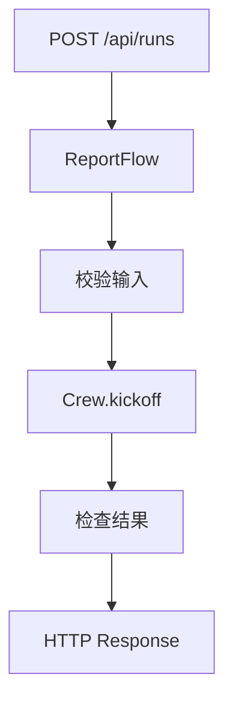

# Demo 05：Flow 状态机

第五个 Demo 加入 Flow。Crew 负责智能体协作，Flow 负责把这次协作放进一个可控的应用流程。

## 目标

实现一个轻量状态机：

```txt
received -> running -> completed / failed
```

## 代码

```ts
type FlowState = {
  topic: string;
  status: "received" | "running" | "completed" | "failed";
  result?: string;
  error?: string;
};

class ReportFlow {
  constructor(private crew: { kickoff(input: { topic: string }): Promise<string> }) {}

  async run(topic: string): Promise<FlowState> {
    const state: FlowState = { topic, status: "received" };

    if (!topic.trim()) {
      return { ...state, status: "failed", error: "topic 不能为空" };
    }

    try {
      state.status = "running";
      const result = await this.crew.kickoff({ topic });
      return { ...state, status: "completed", result };
    } catch (error) {
      return {
        ...state,
        status: "failed",
        error: error instanceof Error ? error.message : "unknown error"
      };
    }
  }
}
```

## 为什么这不是 Crew 的职责

输入校验、状态变更、错误捕获、API 响应，这些都是应用层问题。如果把它们塞进 Agent，会导致 Agent prompt 变复杂，也会让业务可靠性依赖模型输出。

Flow 的价值是把不确定的智能生成包进确定的工程流程里。



## 小练习

给 Flow 加一个 `reviewing` 状态：当 Crew 输出长度小于 200 字时，标记失败并要求重试。想一想这个判断应该写在 Flow 里，还是写在 Agent 里？

