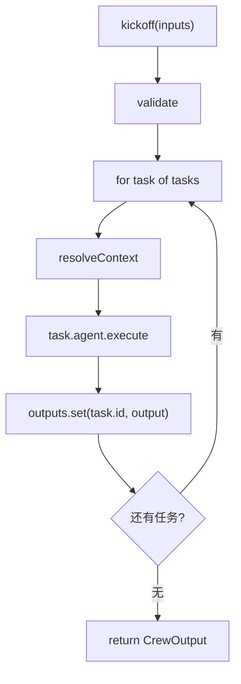

# 后端实现

后端使用 Express + TypeScript。核心不是 Express，而是 `src` 目录里的 mini Crew 结构。

## Agent

`Agent` 的职责是把角色、任务、上下文、工具证据组装成 prompt，然后调用 LLM。

```ts
const prompt = [
  `角色：${this.options.role}`,
  `目标：${this.options.goal}`,
  `背景：${this.options.backstory}`,
  `任务描述：${task.description}`,
  `期望输出：${task.expectedOutput}`,
  "前置任务上下文：",
  contextText || "无"
].join("\n");
```

这段代码背后的设计是：prompt 要可调试。你应该能一眼看出模型为什么得到这些信息。

## Task

`Task` 是一个很薄的类，只保存任务元数据：

```ts
new Task({
  id: "analysis",
  description: "基于调研结果，分析系统应该如何拆分 Agent、Task、Tool 和 Flow。",
  expectedOutput: "包含机会、风险、实现建议的结构化分析。",
  agent: analyst,
  context: [researchTask]
});
```

这里的 `context` 是显式依赖。`analysis` 依赖 `research`，`writing` 依赖两者。

## Crew

`Crew.kickoff()` 是主执行入口。



`validate()` 会检查任务依赖是否已经出现：

```ts
for (const dependency of task.context) {
  if (!seen.has(dependency.id)) {
    throw new Error(`Task ${task.id} 依赖 ${dependency.id}，但该任务尚未执行`);
  }
}
```

这保留了 crewAI sequential process 的关键约束：任务只能依赖已经执行过的任务。

## Flow

`ReportFlow` 负责应用层控制：

- 校验主题不能为空。
- 创建三个 Agent。
- 创建三个 Task。
- 创建 Crew 并启动。
- 包装 Flow 事件。

它没有让 LLM 决定 API 状态，也没有让 Agent 负责 HTTP 响应。这样边界更干净。

## LLM 适配

后端默认使用 `MockLLM`，所以课堂演示不需要 API Key。

如果设置：

```txt
LLM_PROVIDER=openai
LLM_API_KEY=...
LLM_BASE_URL=...
LLM_MODEL=...
```

就会切换到 OpenAI-compatible Chat Completions 接口。这个设计让教学项目能离线运行，也能接入真实模型。

## API

健康检查：

```bash
curl http://localhost:8787/api/health
```

启动一次 Crew：

```bash
curl -X POST http://localhost:8787/api/runs \
  -H "Content-Type: application/json" \
  -d '{"topic":"从零实现一个 multi Agent 学习助手"}'
```

返回对象包含：

| 字段 | 含义 |
| --- | --- |
| `runId` | 本次 Flow 运行 ID。 |
| `status` | `completed` 或 `failed`。 |
| `output.final` | 最终报告。 |
| `output.tasks` | 每个 Task 的输出。 |
| `output.events` | Flow/Crew/Agent/Tool 事件日志。 |

