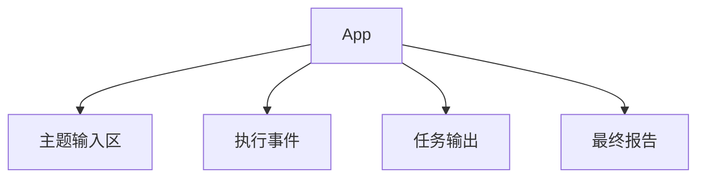

# 前端实现

最终项目的前端使用 React + Vite 实现，目标是提供一个可操作的 multi Agent 运行工作台。页面围绕一次 Crew 执行展开：输入主题、启动任务、查看事件日志、检查每个 Task 的中间输出，并阅读最终报告。

这个前端不是营销页，也不是纯展示页。它对应后端的 Flow / Crew / Agent 执行链路，把原本隐藏在服务端日志里的过程放到页面上，方便理解和调试。

## 页面结构



页面由四个主要区域组成：

| 区域 | 作用 |
| --- | --- |
| 主题输入区 | 输入本次 multi Agent 要研究的主题，并启动 Crew。 |
| 执行事件 | 展示 Flow、Crew、Task、Agent、Tool 的运行顺序。 |
| 任务输出 | 展示每个 Agent 完成的中间结果。 |
| 最终报告 | 展示最后一个 Task 产出的完整报告。 |

## 核心状态

```ts
const [topic, setTopic] = React.useState("从零实现一个 multi Agent 学习助手");
const [result, setResult] = React.useState<RunResponse | null>(null);
const [loading, setLoading] = React.useState(false);
const [error, setError] = React.useState<string | null>(null);
```

这四个状态分别对应：

| 状态 | 作用 |
| --- | --- |
| `topic` | 用户输入。 |
| `result` | 后端返回的完整运行结果。 |
| `loading` | 控制按钮和状态提示。 |
| `error` | 展示 API 或后端错误。 |

这些状态都服务于同一个用户动作：提交一个主题并观察一次完整的 Agent 协作过程。`result` 保留完整响应，而不是只保留最终报告，是为了让页面能同时展示中间任务、事件日志和最终产物。

## 请求后端

```ts
const response = await fetch("http://localhost:8787/api/runs", {
  method: "POST",
  headers: { "Content-Type": "application/json" },
  body: JSON.stringify({ topic })
});
```

示例中直接请求后端地址，便于在教程里看清前后端关系。生产项目可以使用 Vite proxy、反向代理或统一 API 网关来隐藏后端地址。

## 为什么展示事件日志

multi Agent 系统最大的调试难点是“看起来最后输出错了，但不知道哪一步错了”。所以前端会展示事件：

| 类型 | 说明 |
| --- | --- |
| `flow` | 应用流程开始、结束、失败。 |
| `crew` | Crew 启动或完成。 |
| `task` | 任务准备、任务写入上下文。 |
| `agent` | Agent 开始或完成任务。 |
| `tool` | Agent 调用了哪个工具。 |

事件日志相当于给智能体协作加了一条可观测时间线。最终报告如果出现问题，可以先看哪个 Task 的输出偏离预期，再判断是角色设定、任务描述、上下文传递还是工具结果出了问题。

## 扩展方向

- 把最终报告从 `pre` 改成 Markdown 渲染。
- 增加任务重试按钮。
- 给每个 Task 增加耗时统计。
- 用 Server-Sent Events 实时推送事件，而不是等执行完一次性返回。
- 增加“保存本次运行”功能，把结果存进数据库。
