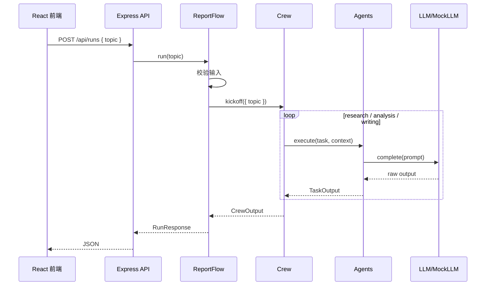

# 最终项目总览

最终项目位于：

```txt
examples/final-multi-agent
```

它实现了一个“多 Agent 报告生成工作台”。用户在前端输入主题，后端创建一个轻量 Flow，再启动一个顺序 Crew。Crew 中有三个 Agent：

| Agent | 责任 |
| --- | --- |
| 资料研究员 | 收集主题相关事实和概念依据。 |
| 系统分析师 | 把事实转成架构判断、风险和建议。 |
| 技术写作者 | 把前两步输出整理成中文技术报告。 |

## 项目结构

```txt
examples/final-multi-agent
├── backend
│   ├── src
│   │   ├── agent.ts
│   │   ├── crew.ts
│   │   ├── flow.ts
│   │   ├── llm.ts
│   │   ├── server.ts
│   │   ├── task.ts
│   │   ├── tools.ts
│   │   └── types.ts
│   ├── package.json
│   └── tsconfig.json
└── frontend
    ├── src
    │   ├── main.tsx
    │   └── styles.css
    ├── index.html
    ├── package.json
    └── tsconfig.json
```

## 执行链路



## 为什么这样拆

后端没有把所有逻辑写进一个 `/api/runs` 回调里，因为那样读者看不出 multi Agent 框架的结构。我们拆成：

| 文件 | 对应概念 |
| --- | --- |
| `agent.ts` | Agent：角色、目标、工具和模型调用。 |
| `task.ts` | Task：任务描述、期望输出和上下文依赖。 |
| `crew.ts` | Crew：校验任务、顺序执行、收集输出。 |
| `flow.ts` | Flow：输入校验、创建 Crew、包装响应。 |
| `tools.ts` | Tool：外部能力的统一接口。 |
| `llm.ts` | LLM 适配：Mock 或 OpenAI-compatible API。 |

这种结构也方便扩展：你可以替换 LLM，可以增加 Tool，可以把 sequential process 替换成 hierarchical process 的教学实现。

## 与 crewAI 官方框架的关系

| 官方 crewAI | 教学项目 |
| --- | --- |
| Python 框架 | Node.js + TypeScript 教学实现 |
| `Crew.kickoff()` | `Crew.kickoff(inputs)` |
| `Agent` 使用 LLM 和 Tools | `Agent.execute()` 构造 prompt 并调用 LLM |
| `Task` 管理描述、期望输出、上下文 | `Task` 类保留这些核心字段 |
| `Process.sequential` / `Process.hierarchical` | 实现 sequential，讲解 hierarchical 扩展 |
| `Flow` 事件与状态控制 | `ReportFlow` 做轻量状态包装 |

## 运行效果

启动后，你会看到三个区域：

- 左侧输入主题并启动 Crew。
- 右侧展示 Flow、Crew、Task、Agent、Tool 事件。
- 下方展示每个 Task 的输出和最终报告。

这就是教学项目最重要的价值：让 Agent 协作过程可见。

