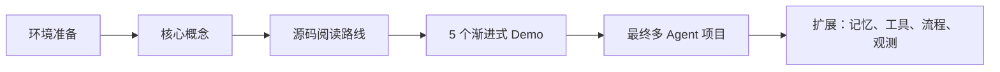

# 教程路线图

这套教程默认读者已经会写基本的 JavaScript / TypeScript，知道什么是 HTTP API，也大概了解 LLM 是“输入 prompt，输出文本”的模型。你不需要先懂 crewAI，也不需要先会 Python。

## 学习目标

完成后你应该能回答这些问题：

| 问题 | 你会在哪里学到 |
| --- | --- |
| 为什么不能只写一个大 prompt，而要拆成多个 Agent？ | [整体架构](/core/overview) |
| Agent、Task、Crew 各自负责什么？ | [Agent / Task / Crew](/core/agent-task-crew) |
| Process 和 Flow 的区别是什么？ | [Process 与 Flow](/core/process-flow) |
| Tool 为什么是 Agent 工程化的关键？ | [Tools / Memory / Knowledge](/core/tools-memory-knowledge) |
| crewAI 的 `kickoff` 大致做了什么？ | [执行链路](/source/execution-chain) |
| 如何用 TypeScript 做一个小型 crewAI？ | [最终项目](/final/project) |

## 推荐学习顺序

## 本教程如何处理 Python crewAI 与 TypeScript Demo

crewAI 本身是 Python 框架。本教程不会假装把它完整移植到 TypeScript，因为那会把学习重点带偏。我们采用两层结构：

| 层次 | 目标 |
| --- | --- |
| 原理层 | 解释 crewAI 官方框架里的关键抽象和执行链路。 |
| 实现层 | 用 TypeScript 写一个教学版 mini Crew，保留 Agent、Task、Crew、Tool、Flow 的核心思想。 |

这样做的好处是：你既能理解真实框架的设计，又能在熟悉的前后端技术栈里把机制跑起来。

## 最终项目能力边界

最终项目会实现：

- 多个 Agent，各自拥有 `role`、`goal`、`backstory`、`tools`。
- 多个 Task，每个 Task 指定描述、期望输出、上下文依赖和执行 Agent。
- 顺序 Process，把前一个 Task 的结果作为后一个 Task 的上下文。
- 一个轻量 Flow，负责接收请求、初始化状态、启动 Crew、返回结果。
- React 前端展示执行过程、Agent 日志和最终报告。

最终项目不会实现：

- 完整的向量数据库记忆。
- 完整的层级管理者 Agent。
- 真实生产环境的鉴权、限流和任务队列。
- 对所有 LLM 供应商的适配。

这些都会在扩展章节说明如何继续做。

## 小练习

在继续之前，先想 2 分钟：如果让一个 Agent 同时“查资料、判断可信度、写报告、改格式”，它可能会在哪些地方失控？把答案写下来，读完 [Agent / Task / Crew](/core/agent-task-crew) 后回来对照。

