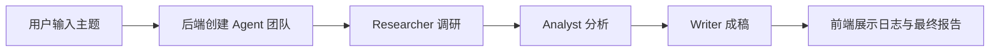

## 你会做出什么

学完这套教程后，你会拥有一个可以运行的教学项目：

它不是 crewAI Python 源码的逐行翻译，而是一套“工程师手把手拆机制”的学习路径：你会知道为什么 multi Agent 需要角色、任务、工具、流程和状态，也会知道这些抽象落到代码里应该长什么样。

## 调研依据

本教程参考了 crewAI 官方仓库与官方文档。调研时间为 2026-06-03，官方文档页面显示版本为 `v1.14.6`。重点依据包括：

- crewAI 官方仓库：[https://github.com/crewAIInc/crewAI](https://github.com/crewAIInc/crewAI)
- crewAI 官方文档：[https://docs.crewai.com](https://docs.crewai.com)
- 官方 README 中对 Crews 与 Flows 的定位：Crews 偏自主协作，Flows 偏生产级、事件驱动和状态控制。
- `Crew` 核心源码中的 `tasks`、`agents`、`process`、`memory`、`cache`、`manager_agent`、`manager_llm`、`kickoff` 等执行入口与校验逻辑。
