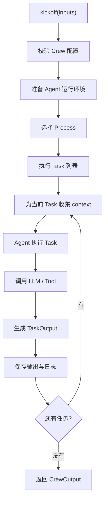
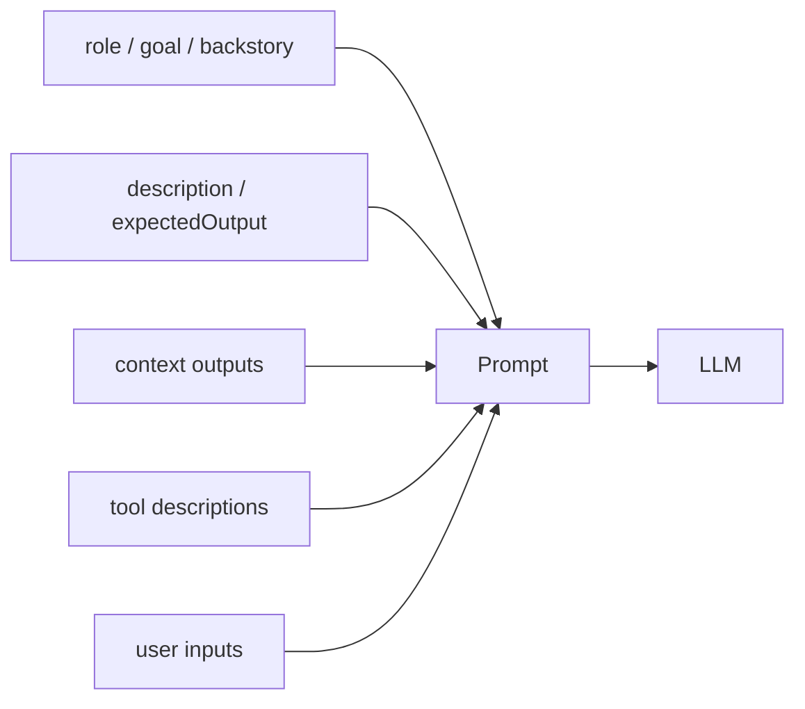

# 执行链路

multi Agent 框架最值得看的不是类名，而是一次任务从输入到输出怎么流动。

## 一次 kickoff 的主链路

在 crewAI 中，用户通常通过 `crew.kickoff(inputs=...)` 启动一个 Crew。教学版会把它实现成：

```ts
const output = await crew.kickoff({ topic: "AI Agent 工程化" });
```

主链路可以抽象成：



## 校验为什么重要

官方源码在执行前会做很多校验。它们不是“形式主义”，而是在防止任务跑到一半才发现配置错了。

| 校验 | 防止的问题 |
| --- | --- |
| Crew 至少有 agents/tasks 或 config | 空 Crew 无法执行。 |
| sequential task 必须有 agent | 顺序执行时没人负责该任务。 |
| hierarchical 必须有 manager | 没有管理者无法委派和校验。 |
| context 不能引用未来任务 | 当前任务不能依赖尚未产生的输出。 |
| 条件任务不能作为第一个任务 | 没有前置结果时无法判断条件。 |

教学版也会保留最核心的校验：Task 必须有 Agent，Task context 只能引用已执行任务。

## Prompt 不是随便拼字符串

Agent 执行 Task 时，至少要把这些信息放进 prompt：

- Agent 的角色、目标、背景。
- Task 的描述和期望输出。
- 前置任务上下文。
- 可用工具清单。
- 用户输入。



好的 prompt 结构不是为了好看，而是为了让系统可以调试。出错时你能看到是角色不清楚、上下文缺失，还是任务验收标准太弱。

## 输出对象要结构化

不要让 Crew 只返回一段字符串。教学版会返回：

```ts
export type CrewOutput = {
  id: string;
  final: string;
  tasks: TaskOutput[];
  events: CrewEvent[];
};
```

这样前端可以展示：

- 每个 Task 的状态。
- 每个 Agent 的输出。
- 执行时间。
- 最终报告。

## 小练习

假设 `analysisTask` 依赖 `researchTask`，但你把 `analysisTask` 放在任务列表第一位。请说明框架应该如何报错，以及为什么不能偷偷帮你重排任务。

