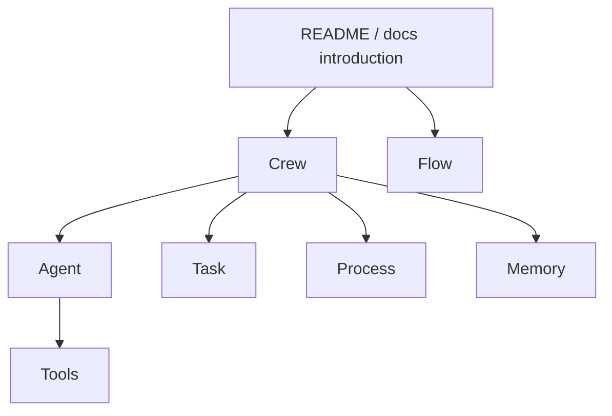

# 仓库结构与阅读路线

crewAI 是一个持续演进的 Python monorepo。调研时，核心 Python 包位于：

```txt
lib/crewai/src/crewai
```

不要一上来就全仓库搜索。更高效的阅读路线是先抓住主干，再看分支能力。

## 建议阅读顺序



## 核心文件关注点

| 方向 | 你要找什么 |
| --- | --- |
| `crew.py` | Crew 的字段、校验、`kickoff`、process 分发、memory/cache 初始化。 |
| `agent.py` | Agent 如何构造 prompt、调用 LLM、使用 tools。 |
| `task.py` | Task 描述、期望输出、上下文、输出保存。 |
| `process.py` | sequential / hierarchical 等执行模式。 |
| `flow/` | Flow、装饰器、事件监听、状态管理。 |
| `tools/` | Tool 抽象与工具调用约定。 |
| `memory/` | 记忆对象、作用域、检索与存储。 |

## 先看字段，再看方法

读源码时不要马上钻进每一个工具类。先问：

- 这个类保存了哪些状态？
- 哪些字段是用户配置？
- 哪些字段是运行时产生？
- 入口方法在哪里？
- 入口方法调用了哪些内部步骤？

以 `Crew` 为例，官方源码里能看到这些关键字段：

| 字段 | 意义 |
| --- | --- |
| `tasks` | Crew 要执行的任务列表。 |
| `agents` | Crew 中可用的 Agent。 |
| `process` | 执行方式，默认 sequential。 |
| `memory` | 是否启用记忆。 |
| `cache` | 是否启用工具或结果缓存。 |
| `manager_llm` / `manager_agent` | hierarchical process 的管理者能力。 |
| `task_callback` | 每个任务完成后的回调。 |

## 为什么源码比概念复杂

教程里的模型很干净：

```txt
Crew -> Task -> Agent -> LLM
```

真实源码会复杂很多，因为它要处理：

- 参数校验。
- 异步任务。
- 条件任务。
- 回调。
- 事件和遥测。
- 记忆和缓存。
- checkpoint / resume。
- 错误恢复。

这很正常。你阅读源码时应该把这些看成“生产化外壳”，不要让它们遮住主干链路。

## 小练习

打开官方仓库，找到 `Crew` 类，并记录它的 5 个字段和 3 个校验方法。不要逐行读实现，只写字段解决什么问题。

